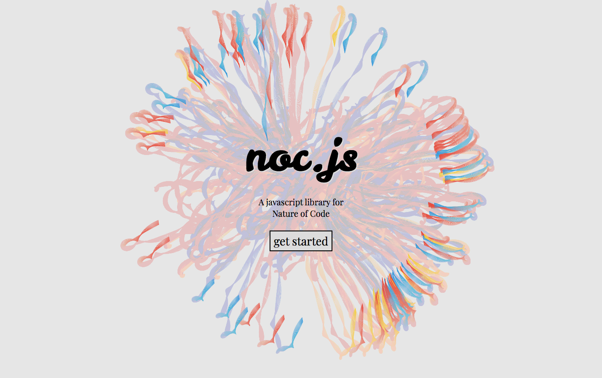

# NOC.js

**WIP Please ignore**



## About

This project is based on Dan Shiffman's Nature of Code book and [code examples](https://github.com/nature-of-code/noc-examples-p5.js). Credits go to Dan and all of the people who have contributed to building those examples. 

This library is being built to make it easier to quickly breath "life" into your p5.js projects by simulating natural systems and behaviors with code. Dan's Nature of Code helped me to discover the beauty and expressivenes of code and continues to be a major influence in my creative practice. 

I hope you can find inspiration in the natural world and find new ways to simulate them with code. Happy coding!


## Docs

* [docs](https://joeyklee.github.io/nocjs/docs/#/)

## Examples

see: [/examples](/examples)

## Get the Library

beta:
```
https://unpkg.com/nocjs@latest/dist/nocjs.min.js
```

see versions:
https://www.npmjs.com/package/nocjs

## Credits:
* **Nature of Code** by Dan Shiffman
* **Nature of Code Examples** by Dan Shiffman and contributors
* **Developing an open source library** Following along Kent C. Dodd's wonderful Open source software development series: https://egghead.io/lessons/javascript-publishing-to-npm

## Demos

* Special Spring: https://editor.p5js.org/joeyklee/sketches/ORZ-MNb5B
* oscillating path followers: https://editor.p5js.org/joeyklee/full/sMUJRKafG

(More coming soon)

***
***
***

## Develop

The process goes something like:
* setup
* make new features or fix stuff
* build the library
* publish

### Setup and start
```
cd nocjs
npm install
npm run start
```

the library will be served at: `localhost:<PORT>/nocjs.js`

Add your classes in the [/src](/src) directory with a folder called `/MyClassName` that includes:
* index.js
* index_test.js

`import` and add your new class name to the `/src/index.js` as you see it done with the others.

### Build

```
npm run build
```


### Publish

First change the version name in `package.json`

```sh
git add .
git commit -m "bumped version"
npm run publish:gh
```

then publish to npm

```sh
npm run publish:npm
```


## WIP - the todo list!

Working through these: https://github.com/nature-of-code/noc-examples-p5.js

* Mover 
  * euler integration ✅
  * friction ✅
  * resistance ✅
  * repel ✅
  * attract ✅
  * seek ✅
  * arrive ✅
  * path-following ✅
  * stay-within-walls ==> "contain" ✅
  * flow field ✅
  * separation ✅
  * flocking ✅
* Wave ✅
* Path ✅
  * path-simple ✅
  * path-complex ✅
* Pendulum ✅
* Spring ✅
* Particle systems ✅
* Cellular Automata
  * wolfram
  * gameoflife
* Fractals
  * recursion
  * cantor set
  * koch
  * tree
  * lsystem
* Genetic Algorithms
  * traditional
  * interactive selection

